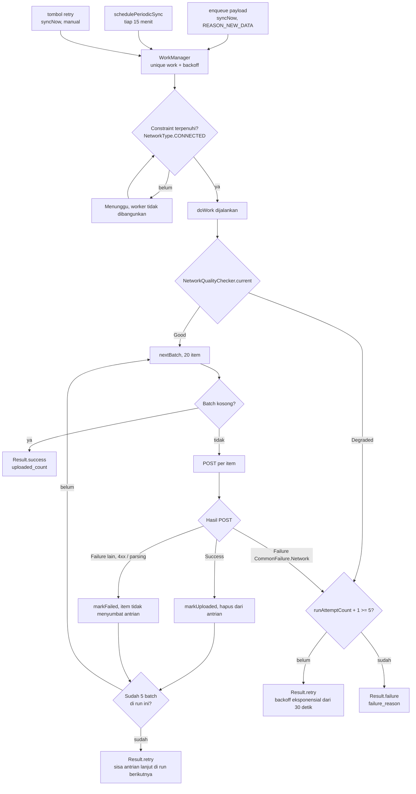
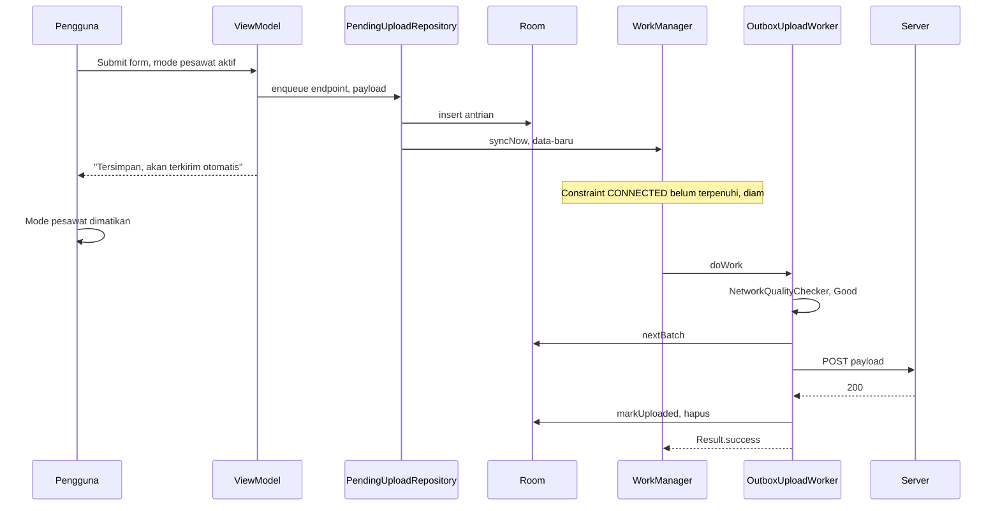

# OutboxUploadWorker — Flow & Cara Kerja Nyata

`core/sync/OutboxUploadWorker.kt` adalah `CoroutineWorker` yang menguras antrian outbox di Room
lewat HTTP POST. Tugasnya satu: setiap kali dibangunkan, kirim apa yang tertunda, lalu laporkan
`success` / `retry` / `failure` ke WorkManager.

Dokumen ini fokus pada **alurnya**, **bagaimana ia dibangun**, dan **apa yang membuatnya benar-benar
jalan di perangkat**. Referensi ambang batas dan contoh pemakaian API ada di
[`WORKMANAGER_SYNC.md`](./WORKMANAGER_SYNC.md).

## Berkas yang terlibat

| Berkas | Peran |
|---|---|
| `core/sync/OutboxUploadWorker.kt` | Worker-nya sendiri |
| `core/sync/SyncScheduler.kt` | Satu-satunya pintu enqueue ke WorkManager |
| `core/sync/NetworkQualityChecker.kt` | Menilai koneksi tembus dan cukup cepat |
| `core/sync/SyncDefaults.kt` | Ambang batas dan nama unique work |
| `domain/sync/repository/PendingUploadRepository.kt` | Kontrak antrian outbox |
| `BcafApplication.kt` | `HiltWorkerFactory` + `schedulePeriodicSync()` |

## Alur satu kali jalan



Dua hal yang penting dari diagram itu:

- **Kegagalan jaringan dibedakan dari kegagalan bisnis.** `CommonFailure.Network` menghentikan batch
  dan menyerahkan urusan ke backoff. Kegagalan lain ditandai gagal permanen supaya satu payload
  rusak tidak memblokir seluruh antrian.
- **Ada batas kerja per run.** Maksimal 5 batch, lalu `retry`. Sistem bisa membunuh worker setelah
  ~10 menit, jadi run panjang dipecah dengan sengaja.

## Kasus nyata: form dikirim saat offline



UI tidak pernah menunggu jaringan. Ia hanya menulis ke Room dan langsung selesai — pengiriman
adalah tanggung jawab worker.

## Proses pembuatannya

Urutan pengerjaan, beserta alasan tiap langkah:

1. **Kontrak dulu, implementasi kemudian.** `PendingUploadRepository` ditulis sebagai interface di
   `domain/` — `nextBatch`, `upload`, `markUploaded`, `markFailed`. Worker hanya bicara ke interface
   ini, sehingga worker sudah final walau Room/Retrofit-nya belum ada.
2. **Konstanta dikumpulkan di satu tempat.** `SyncDefaults` menampung semua ambang batas dan nama
   unique work, supaya tuning tidak perlu menyentuh worker.
3. **Penjadwalan dipusatkan.** `SyncScheduler` jadi satu-satunya kelas yang menyentuh
   `WorkManager`. Fitur lain tidak boleh enqueue langsung — kalau nama unique work tersebar,
   `ExistingWorkPolicy` jadi tidak bisa dipercaya.
4. **Pemeriksaan koneksi lapis kedua.** `NetworkType.CONNECTED` hanya menjamin "ada jaringan",
   bukan "internet tembus". `NetworkQualityChecker` membaca `NetworkCapabilities` untuk menangkap
   captive portal, jaringan tersuspensi, dan bandwidth terlalu rendah. Inilah baris pertama
   `doWork()`.
5. **Worker ditulis terakhir**, dan isinya sengaja tipis: cek koneksi, ambil batch, kirim, tandai,
   ulangi. Keputusan `retry` vs `failure` diisolasi di `retryOrGiveUp()`.
6. **Pemicu ditempel di jalur tulis, bukan observer.** `enqueue()` memanggil `syncNow()` tepat
   setelah insert. Tidak ada observer permanen atas tabel Room karena worker bukan proses yang
   hidup selamanya.

## Yang membuatnya jalan secara nyata

Tiga hal ini bukan opsional — tanpa salah satunya worker gagal di perangkat, bukan di compile time.

**1. Worker harus bisa dikonstruksi oleh Hilt.** `@HiltWorker` + `@AssistedInject` butuh
`HiltWorkerFactory` terdaftar. `BcafApplication` mengimplementasikan `Configuration.Provider`:

```kotlin
override val workManagerConfiguration: Configuration
    get() = Configuration.Builder()
        .setWorkerFactory(workerFactory)
        .build()
```

**2. Inisialisasi otomatis WorkManager harus dimatikan.** Kalau `WorkManagerInitializer` tetap
aktif, WorkManager terinisialisasi dengan factory default sebelum `Configuration.Provider` terbaca,
dan worker gagal dibuat saat runtime — WorkManager mencatat `Could not instantiate ...Worker`
lalu pekerjaan langsung berhenti. Di `AndroidManifest.xml`:

```xml
<meta-data
    android:name="androidx.work.WorkManagerInitializer"
    android:value="androidx.startup"
    tools:node="remove" />
```

**3. Ada yang benar-benar memanggil `enqueue()`.** Worker tidak menemukan pekerjaan dengan
sendirinya. Fitur yang mengirim data memanggil satu baris ini, lalu selesai:

```kotlin
pendingUploadRepository.enqueue(
    endpoint = "v1/loan-applications",
    payload = json.encodeToString(form),
)
```

Selain itu, hal-hal yang berlaku di perangkat nyata dan sudah diperhitungkan:

- **Periodic minimum 15 menit.** Nilai lebih kecil akan dinaikkan sendiri oleh WorkManager.
- **Doze / App Standby menunda run.** Karena itu periodic hanya jaring pengaman; jalur cepatnya
  tetap `syncNow()` saat data masuk.
- **Proses mati tidak menghilangkan pekerjaan.** WorkManager menyimpan antrian kerjanya di database
  internal, dan payload-nya sendiri ada di Room. Keduanya bertahan sampai reboot.
- **`schedulePeriodicSync()` aman dipanggil setiap start** karena memakai `ExistingPeriodicWorkPolicy.KEEP`.

## Verifikasi di perangkat

```bash
# 1. Pantau log seluruh jalur sync
adb logcat -s OutboxUploadWorker SyncScheduler PendingUploadRepo

# 2. Lihat job yang benar-benar terdaftar di sistem
adb shell dumpsys jobscheduler | grep -i bcaf_test_1

# 3. Paksa jalan sekarang, abaikan constraint. Ambil <jobId> dari langkah 2
adb shell cmd jobscheduler run -f com.masesas.exercise.bcaf_test_1 <jobId>

# 4. Uji jalur offline: matikan jaringan, submit data, lalu nyalakan kembali
adb shell svc data disable && adb shell svc wifi disable
adb shell svc data enable && adb shell svc wifi enable

# 5. Uji perilaku saat Doze
adb shell dumpsys deviceidle force-idle
adb shell dumpsys deviceidle unforce
```

Log yang menandakan alur sehat:

```
SyncScheduler: sync berkala terjadwal setiap 15 menit
PendingUploadRepo: payload masuk antrian untuk v1/loan-applications
SyncScheduler: sync sekali jalan di-enqueue, alasan=data-baru
OutboxUploadWorker: mulai, percobaan ke-1 dari 5
OutboxUploadWorker: koneksi layak (12000 kbps), mulai menguras outbox
OutboxUploadWorker: batch 1 berisi 3 item
OutboxUploadWorker: POST sukses id=41 endpoint=v1/loan-applications
OutboxUploadWorker: outbox kosong, selesai. total terkirim=3
```
