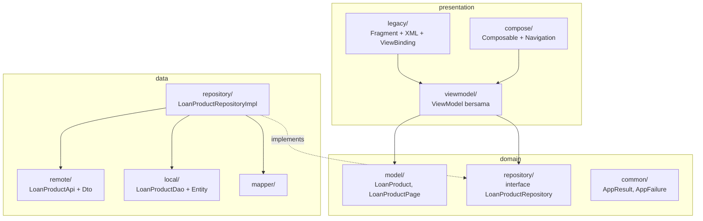
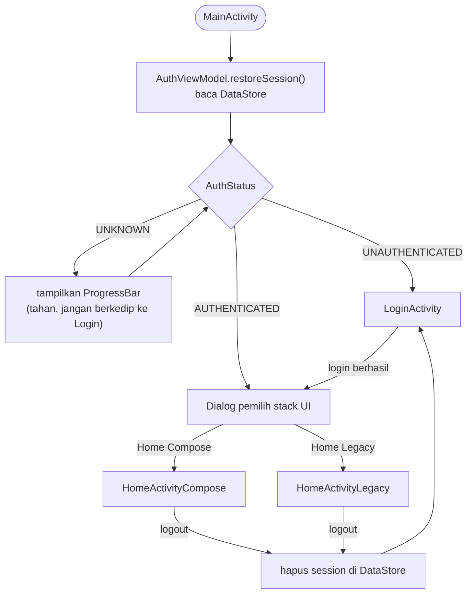
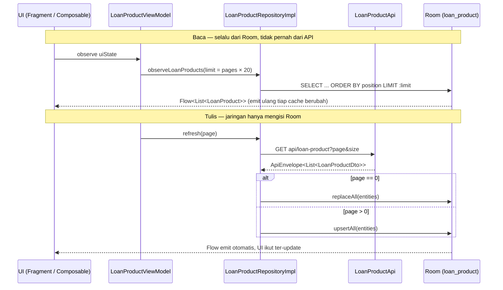

# Arsitektur Aplikasi

> Dokumen ini menjelaskan **kenapa** kode disusun seperti sekarang — bukan mengulang apa yang
> sudah terbaca dari kode. Setiap keputusan disertai alternatif yang ditolak dan alasannya,
> supaya reviewer bisa menilai pertimbangannya, bukan hanya hasil akhirnya.

---

## 1. Ringkasan

Tiga karakteristik yang membentuk seluruh struktur:

| Karakteristik | Konsekuensi |
|---|---|
| **Layered: data → domain → presentation** | Domain tidak tahu Retrofit maupun Room. Repository interface hidup di domain, implementasinya di data. |
| **Offline-first** | UI **tidak pernah** membaca dari jaringan. Room adalah satu-satunya sumber baca; jaringan hanya menulis ke Room. |
| **Dua stack UI paralel** | Setiap layar punya versi Fragment/XML dan versi Compose, berbagi satu ViewModel. |

Yang ketiga bukan sisa migrasi yang belum selesai — ini disengaja, karena tujuan project ini
memang mendemonstrasikan kedua pendekatan pada fitur yang identik.

---

## 2. Peta layer dan aturan dependency



**Aturan yang dijaga:**

1. Panah tidak pernah mengarah dari `domain` ke `data` atau `presentation`. Domain adalah pusat.
2. `presentation` bergantung pada **interface** repository, bukan implementasinya. Hilt yang
   menyambungkan keduanya (`di/LoanProductModule.kt`).
3. DTO tidak pernah bocor ke atas. `LoanProductDto` (nama field mengikuti API: `kode`, `nama`,
   `bungaPersen`) berhenti di layer data; `LoanProduct` (nama field domain: `code`, `name`,
   `interestPercent`) yang naik ke ViewModel.

Alasan pemisahan nama itu penting: kalau API berganti nama field, yang berubah hanya DTO dan
mapper — UI dan ViewModel tidak tersentuh.

---

## 3. Entry point

`MainActivity` adalah launcher, tapi **tidak punya UI selain indikator loading** — perannya
murni router berdasarkan ada-tidaknya session di DataStore.



Tiga hal yang disengaja pada alur ini:

1. **Status `UNKNOWN` ditahan, bukan diperlakukan sebagai "belum login".** Membaca DataStore
   bersifat asinkron; kalau `UNKNOWN` langsung dianggap belum login, user yang sudah login akan
   melihat layar Login berkedip sepersekian detik sebelum dilempar balik.
2. **Dialog didorong oleh state (`uiState.isLoggedIn`), bukan oleh event sekali-jalan.**
   Konsekuensinya dialog selamat dari rotasi layar. Kalau digantung pada `AuthEvent.LoggedIn`,
   dialog hilang saat konfigurasi berubah dan user terjebak di layar kosong.
3. **Membatalkan dialog menutup Activity pemanggil.** Tanpa ini, membatalkan dialog akan
   menyisakan layar router yang kosong tanpa jalan keluar.

4. **Logout tidak menavigasi sendiri — ia hanya menghapus session.** Kedua Home mengamati
   `AuthUiState.isLoggedOut` dan bereaksi terhadap perubahan status, bukan terhadap hasil
   pemanggilan `logout()`. Sumber kebenarannya tetap satu: DataStore.

   Perhatikan `isLoggedOut` ditulis `status == UNAUTHENTICATED`, **bukan** `!isLoggedIn`.
   Perbedaannya menentukan: `!isLoggedIn` juga bernilai `true` saat status masih `UNKNOWN`,
   sehingga user akan dilempar ke LoginActivity setiap kali Home dibuka — sebelum session
   sempat terbaca. Perilaku ini dikunci oleh test
   `selama session belum selesai dibaca user belum dianggap logout`.

Activity pemanggil di-`finish()` setelah memilih, sehingga tombol back dari Home keluar aplikasi
alih-alih kembali ke dialog. Logout memakai `FLAG_ACTIVITY_CLEAR_TASK` sehingga back setelah
logout keluar aplikasi, bukan kembali ke layar yang sudah tidak boleh diakses.

Kedua Home menampilkan 4 tab yang sama (Home, Transaction, Notification, Profile). Yang sudah
terisi penuh saat ini adalah **Home** — daftar produk pinjaman berpaginasi. Tab lain masih
placeholder.

Semua Activity yang menyuntik ViewModel wajib `@AndroidEntryPoint`. Tanpa itu, injeksi gagal
saat runtime, bukan saat compile.

---

## 4. Alur data satu layar berpaginasi

Ini inti dari desain offline-first. Perhatikan bahwa UI hanya punya satu jalur baca:



Konsekuensi yang paling terasa: **saat jaringan mati, layar tidak kosong.** `refresh()` gagal,
tapi `Flow` dari Room tetap memegang data terakhir dan UI tetap terisi. Tidak ada kode khusus
"mode offline" — itu jatuh gratis dari struktur ini.

---

## 5. Keputusan desain dan alasannya

### 5.1 Room sebagai satu-satunya sumber baca

**Alternatif yang ditolak:** ViewModel memanggil API, menyimpan hasil di `MutableStateFlow`,
dan menulis ke Room sebagai cache sampingan.

**Kenapa ditolak:** pola itu punya dua sumber kebenaran yang bisa berbeda isi. Setiap penulisan
harus diduplikasi ke keduanya, dan bug "UI menampilkan data lama padahal DB sudah baru" muncul
cepat. Dengan Room sebagai satu-satunya pembaca, konsistensi bukan sesuatu yang harus dijaga
manual — hanya ada satu tempat yang bisa salah.

**Harga yang dibayar:** setiap data yang mau ditampilkan wajib punya entity Room. Untuk data
sekali pakai yang tidak perlu bertahan, ini overhead. Di kasus daftar produk, data memang layak
di-cache, jadi harganya sepadan.

### 5.2 Kolom `position` pada entity

`LoanProductEntity` punya kolom `position` yang tidak ada di response API. Isinya
`page × size + index`.

**Kenapa perlu:** `ORDER BY id` **tidak** setara dengan urutan yang dikirim server. Begitu
parameter `sort` dipakai (skema `Pageable` mengizinkannya), urutan API bisa apa saja, sedangkan
`id` tetap menaik. Tanpa `position`, item halaman 2 bisa menyelip di antara item halaman 1
setelah ditulis ke Room.

Ini jenis bug yang tidak muncul di data uji yang kebetulan urut — dan baru ketahuan di produksi.

### 5.3 Paginasi terjadi di Room, bukan di memori

```kotlin
loadedPages                                    // MutableStateFlow<Int>
    .flatMapLatest { pages ->
        repository.observeLoanProducts(pages * PAGE_SIZE)   // → SQL LIMIT
    }
```

**Alternatif yang ditolak:** simpan `List<LoanProduct>` di ViewModel dan `+=` setiap load more.

**Kenapa ditolak:** daftar akumulatif di memori tidak akan ter-update kalau cache berubah dari
sumber lain, dan hilang setiap process death. Dengan pendekatan ini, "berapa banyak yang
ditampilkan" hanyalah angka (`loadedPages`), dan datanya selalu datang segar dari query.
Load more = menaikkan angka, bukan menggabungkan list.

**Efek samping yang disengaja:** karena `LIMIT` selalu dihitung ulang, penambahan satu halaman
memicu satu query ulang untuk seluruh rentang. Untuk ukuran halaman 20 dan daftar puluhan sampai
ratusan baris, biayanya tidak terasa. Untuk daftar puluhan ribu baris, ini titik di mana
**Paging 3** dengan `RemoteMediator` jadi pilihan yang lebih tepat — lihat §8.

### 5.4 Refresh halaman 0 menghapus halaman berikutnya

`refresh()` memanggil `dao.replaceAll()` (hapus lalu tulis), bukan `upsertAll()`.

**Ini disengaja, bukan bug.** Kalau server sudah menghapus sebuah produk, `upsertAll` tidak akan
pernah membuangnya dari cache — baris itu jadi hantu yang bertahan selamanya. `replaceAll`
membuat halaman pertama menjadi titik sinkronisasi yang jujur.

Konsekuensinya `loadedPages` di-reset ke 1, jadi setelah refresh pengguna kembali ke 20 item
pertama. Ini perilaku yang lazim pada pull-to-refresh dan diterima.

### 5.5 Error tidak boleh menutupi cache

```kotlin
val blockingFailure: AppFailure? get() = failure.takeIf { items.isEmpty() }
```

Kegagalan hanya ditampilkan sebagai layar error kalau memang tidak ada yang bisa ditampilkan.
Kalau cache berisi, kegagalan refresh diabaikan secara visual — pengguna tetap melihat data.

Tanpa pembedaan ini, aplikasi offline-first kehilangan seluruh manfaatnya: datanya ada, tapi
tertutup dialog "gagal memuat".

Pelengkapnya di `restoreCachedPages()`: saat cold start, `repository.cachedCount()` dibaca untuk
memulihkan berapa halaman yang sudah tersimpan. Tanpa ini, cache berisi 60 baris hanya akan
tampil 20 karena `loadedPages` mulai dari 1.

### 5.6 ViewModel bersama di-scope ke Activity

Ini bagian yang paling mudah salah dan paling sunyi kegagalannya.

| Stack | Cara mengambil | Scope |
|---|---|---|
| Legacy | `by activityViewModels()` | ViewModelStore milik Activity |
| Compose | `sharedActivityViewModel()` → `hiltViewModel(LocalActivity.current)` | ViewModelStore milik Activity |

**Jebakannya:** `hiltViewModel()` tanpa argumen di dalam graph Navigation Compose akan
men-scope ViewModel ke **`NavBackStackEntry`**, bukan Activity. Hasilnya setiap destination
punya instance sendiri, state paging tidak terbagi, dan **tidak ada error apa pun** — hanya
perilaku yang diam-diam salah. Helper `sharedActivityViewModel()` di
`presentation/compose/ui/SharedViewModel.kt` ada khusus untuk menutup lubang ini.

### 5.7 Kegagalan sebagai nilai, bukan exception

```kotlin
sealed interface AppResult<out T> {
    data class Success<out T>(val data: T) : AppResult<T>
    data class Failure(val failure: AppFailure) : AppResult<Nothing>
}
```

`runApiCatching` menangkap `HttpException`/`IOException` di batas data layer dan
menerjemahkannya jadi `CommonFailure` bertipe. Di atas batas itu, tidak ada `try/catch` lagi —
`when` yang exhaustive memaksa setiap pemanggil menangani cabang gagal.

`CancellationException` sengaja di-rethrow, bukan ditangkap. Menelannya akan merusak
pembatalan coroutine secara struktural.

Pemetaan kegagalan ke teks terjadi di `core/ui/AuthMessages.kt` lewat `UiMessage`, sehingga
domain tetap bebas dari `Context` dan `R.string`, dan pesan yang sama bisa dipakai kedua stack UI.

---

## 6. RecyclerView vs LazyColumn untuk kasus ini

Karena daftar yang sama diimplementasikan dua kali, perbandingannya bisa dilakukan langsung.

| | RecyclerView | LazyColumn |
|---|---|---|
| Artefak yang dibutuhkan | 2 layout XML, Adapter, ViewHolder, DiffUtil, OnScrollListener | 2 Composable |
| Identitas item | `DiffUtil.ItemCallback` | `key = { it.id }` |
| Deteksi load more | `findLastVisibleItemPosition()` di scroll listener | `derivedStateOf` + `snapshotFlow` |
| Daur ulang | Reuse objek `View` | Reuse slot komposisi |

**Untuk kasus ini LazyColumn lebih tepat** — bukan karena lebih cepat, tapi karena ongkos
kodenya jauh lebih kecil untuk hasil yang setara. Keduanya sama-sama hanya merender item yang
terlihat, jadi soal memori tidak ada bedanya yang berarti.

Deteksi load more di Compose juga lebih jujur: `derivedStateOf` bersifat deklaratif terhadap
posisi scroll dan hanya memancarkan perubahan saat nilai boolean-nya benar-benar berubah,
sedangkan `OnScrollListener` terpanggil pada setiap frame scroll dan bisa memicu berkali-kali.
Di implementasi ini keduanya tetap aman karena guard-nya ada di ViewModel
(`if (isRefreshing || isLoadingMore || !hasNextPage) return`) — pertahanan tidak diletakkan di UI.

**Kapan RecyclerView tetap menang:** banyak view type dengan layout berat, animasi item kompleks,
drag-and-drop, atau daftar sangat panjang dengan konten mahal di-compose. Untuk item 5 baris teks
seperti produk pinjaman, semua itu tidak relevan.

**Yang harus dihindari di Compose:** `Column` + `verticalScroll(rememberScrollState())`. Itu
merender **seluruh** item sekaligus dan akan langsung bermasalah setelah beberapa kali load more.

---

## 7. Strategi test

| Lapis | Lokasi | Yang diuji |
|---|---|---|
| Repository | `test/.../loan/LoanProductRepositoryImplTest.kt` | Posisi berurutan, `replaceAll` vs `upsertAll`, `LIMIT` dihormati, `hasNextPage` di halaman terakhir, kegagalan jaringan tidak menghapus cache |
| ViewModel (auth) | `test/.../auth/AuthViewModelTest.kt` | Status dari session tersimpan (prasyarat routing MainActivity), login berhasil/gagal, dan **validasi menahan request sebelum menyentuh data layer** |
| ViewModel (paging) | `test/.../loan/LoanProductViewModelTest.kt` | Muat awal, load more menambah tepat satu halaman, berhenti di halaman terakhir, refresh reset ke halaman 1, cold start offline tetap menampilkan cache |
| Migrasi Room | `androidTest/.../database/BcafDatabaseMigrationTest.kt` | 1→2 (konversi tipe kolom tanpa kehilangan nilai), 2→3 (pembuatan tabel `loan_product`), dan rantai 1→3 yang dibaca ulang lewat DAO |

Test memakai **fake, bukan mock**: `FakeLoanProductDao` menirukan `ORDER BY position LIMIT`,
`FakeLoanProductApi` menirukan pemotongan halaman dan bisa disuruh gagal. Fake lebih tahan
terhadap refactor daripada mock yang memverifikasi urutan pemanggilan, dan `FakeLoanProductDao`
sekaligus mendokumentasikan kontrak DAO yang diharapkan.

Test paling berharga di sini adalah `offline saat cold start tetap menampilkan cache` — itu yang
mengunci perilaku offline-first agar tidak hilang tanpa sengaja di kemudian hari.

---

## 8. Batasan yang diketahui

Ditulis eksplisit supaya tidak terbaca sebagai kelalaian.

1. **Bukan Paging 3.** Implementasi ini menggunakan paging manual. Untuk kebutuhan saat ini
   (daftar puluhan sampai ratusan baris) itu memadai dan jauh lebih mudah dibaca. Untuk daftar
   sangat panjang, `RemoteMediator` + `PagingSource` adalah jalur yang benar — dan pemisahan
   layer di sini membuat perpindahan itu hanya menyentuh repository dan ViewModel.
2. **Tidak ada pull-to-refresh.** Yang diminta hanya load more, jadi dependency
   `swiperefreshlayout` tidak ditambahkan. `refresh()` sudah tersedia di ViewModel, tinggal
   dipasang pemicunya.
3. **`loadedPages` tidak bertahan melewati process death.** Setelah aplikasi dimatikan sistem,
   posisi dipulihkan lewat `cachedCount()` — mendekati, tapi tidak identik dengan posisi scroll
   sebelumnya. `SavedStateHandle` bisa dipakai kalau presisi itu diperlukan.
4. **Slice `LoanApplication` belum punya UI.** Data dan domain-nya lengkap, tapi belum ada layar
   yang memakainya.
5. **Status sesi belum ditampilkan di layar Compose.** `AuthViewModel` sudah dipakai
   `HomeActivityCompose` untuk logout, tapi `HomeScreen` belum menampilkan identitas user
   seperti yang dilakukan `HomeFragment`.
6. **Refresh mengorbankan halaman yang sudah dimuat** (§5.4) — trade-off yang disadari, bukan bug.

---

## 9. Peta file

```
domain/loan/
├── model/LoanProduct.kt              # model domain, bebas anotasi framework
├── model/LoanProductQuery.kt         # page / size / sort — PAGE_SIZE default 20
├── model/LoanProductPage.kt          # metadata paging + hasNextPage
└── repository/LoanProductRepository.kt   # kontrak: observe / refresh / cachedCount

data/loan/
├── remote/LoanProductApi.kt          # GET api/loan-product
├── remote/LoanProductDto.kt          # nama field mengikuti API
├── local/LoanProductEntity.kt        # + kolom position (§5.2)
├── local/LoanProductDao.kt           # observePaged(limit) — LIMIT ada di sini
├── mapper/LoanProductMapper.kt       # Dto → Entity → Domain
└── repository/LoanProductRepositoryImpl.kt

MainActivity.kt                       # router: DataStore → Login atau dialog

presentation/
├── viewmodel/loan/LoanProductViewModel.kt   # loadedPages, refresh, loadMore
├── viewmodel/loan/LoanProductUiState.kt     # blockingFailure (§5.5)
├── legacy/home/HomeFragment.kt              # RecyclerView
├── legacy/home/LoanProductAdapter.kt
├── legacy/home/LoadMoreScrollListener.kt
├── compose/home/HomeScreen.kt               # LazyColumn
├── compose/home/LoanProductItem.kt
└── compose/ui/SharedViewModel.kt            # scope Activity (§5.6)

presentation/auth/
├── LoginActivity.kt                  # form login, state-driven
├── HomeDestinationDialog.kt          # dialog pemilih stack, dipakai 2 Activity
└── LoginNavigation.kt                # kembali ke Login setelah logout (CLEAR_TASK)

core/
├── network/ApiEnvelope.kt            # statusCode / message / data / meta / error
├── network/ApiCall.kt                # runApiCatching, requirePayload
├── database/BcafDatabase.kt          # versi 3
└── database/BcafMigrations.kt        # MIGRATION_1_2, MIGRATION_2_3
```

---

## Referensi terkait

- [Room Migration Handbook](room-migration-handbook.md) — workflow schema export dan pola migrasi.
- [Kotlin Coroutines Handbook](kotlin-coroutines-handbook/README.md) — coroutine per layer, `flatMapLatest`, testing.
- [Jetpack Compose UI Slicing Handbook](jetpack-compose-ui-handbook/README.md) — pola slicing dan studi kasus layar produk.
- [`api-contract/`](api-contract/) — skema response dan `Pageable` yang jadi dasar DTO dan query.
