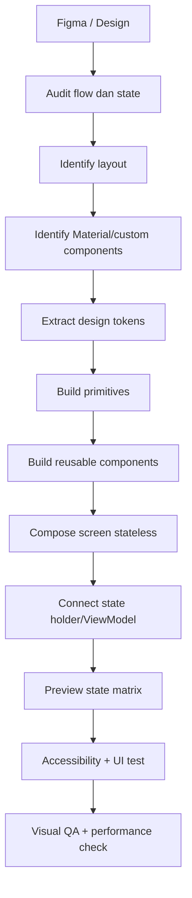

# 06 — Workflow Figma ke Compose

[← Modifier dan Design System](05-modifier-design-system.md) · [Index](README.md) · [Common Patterns →](07-common-slicing-patterns.md)

## 1. Workflow konkret



### Tahap 1 — Audit flow dan state

Jangan mulai dari layer paling atas. Catat terlebih dahulu:

- tujuan screen dan primary action;
- state normal, loading, empty, error, offline, disabled, selected, focused;
- content yang dapat memanjang, hilang, atau berubah karena localization;
- navigation/back behavior;
- keyboard/IME behavior;
- layout pada compact, medium, expanded, landscape, dan font scale besar.

Output: `ScreenUiState`, daftar event, dan state matrix untuk preview.

### Tahap 2 — Identify layout

Tandai setiap frame sebagai salah satu dari:

- horizontal → `Row`;
- vertical → `Column`;
- overlay → `Box`;
- wrapping → `FlowRow`;
- long collection → lazy layout;
- paging → pager;
- adaptive pane → Material 3 Adaptive scaffold;
- custom geometry → Canvas/drawing/custom `Layout` sebagai pilihan terakhir.

Hindari menyalin seluruh hierarchy Figma. Frame Figma sering dibuat untuk organisasi designer, bukan karena setiap frame harus menjadi composable atau container runtime.

### Tahap 3 — Identify components

Untuk setiap node tanyakan:

1. Apakah sudah ada komponen Material 3 dengan semantics yang sama?
2. Apakah visualnya dapat dicapai melalui parameter/slot/theme?
3. Jika tidak, apakah primitive Foundation cukup?
4. Apakah pola berulang dan layak menjadi reusable component?
5. State apa yang harus dikontrol caller?

Output: component inventory, misalnya `AppTopBar`, `LoanMetric`, `BenefitCard`, `PrimaryActionButton`.

### Tahap 4 — Identify design tokens

Ekstrak Figma variables/styles:

- semantic color roles;
- typography hierarchy;
- spacing scale;
- shape scale;
- elevation;
- icon/image sizes;
- max content width dan breakpoint.

Jangan copy `#RRGGBB`, font size, dan gap ke puluhan call site.

### Tahap 5 — Build primitive components

Primitive adalah wrapper tipis yang menegakkan design system, contohnya:

```kotlin
@Composable
fun AppSectionTitle(text: String, modifier: Modifier = Modifier) {
    Text(
        text = text,
        style = MaterialTheme.typography.titleLarge,
        color = MaterialTheme.colorScheme.onSurface,
        modifier = modifier,
    )
}
```

Jangan membungkus setiap Material component tanpa nilai tambah. Wrapper harus menegakkan token, behavior, semantics, atau variasi produk.

### Tahap 6 — Build reusable components

Pecah berdasarkan tanggung jawab dan konsep UI, bukan berdasarkan setiap `Row`.

```text
ProfileScreen
├── ProfileHeader
├── ProfileStats
│   └── ProfileStatItem
├── ProfileMenu
│   └── ProfileMenuItem
└── LogoutButton
```

```kotlin
@Composable
fun ProfileHeader(
    name: String,
    subtitle: String,
    avatarUrl: String,
    onEdit: () -> Unit,
    modifier: Modifier = Modifier,
) { /* render only */ }

@Composable
fun ProfileStats(
    stats: List<ProfileStatUi>,
    modifier: Modifier = Modifier,
) {
    Row(modifier.fillMaxWidth()) {
        stats.forEach { ProfileStatItem(it, Modifier.weight(1f)) }
    }
}

@Composable
fun ProfileMenu(
    items: List<ProfileMenuUi>,
    onItemClick: (String) -> Unit,
    modifier: Modifier = Modifier,
) {
    Column(modifier) {
        items.forEach { item -> ProfileMenuItem(item, { onItemClick(item.id) }) }
    }
}
```

Pisahkan composable ketika:

- memiliki konsep/nama yang jelas dalam design;
- muncul berulang;
- memiliki state/interaction sendiri;
- membutuhkan preview/test terpisah;
- parent terlalu sulit dibaca;
- memiliki slot atau variasi yang stabil.

Jangan membuat komponen terlalu generik dengan puluhan Boolean seperti `isRed`, `hasIcon`, `isBig`, `useBorder`. Modelkan variant dengan enum/data/slot yang bermakna.

### Tahap 7 — Build stateless screen

```kotlin
@Composable
fun ProfileScreen(
    state: ProfileUiState,
    onEvent: (ProfileEvent) -> Unit,
    modifier: Modifier = Modifier,
) {
    Scaffold(modifier = modifier) { innerPadding ->
        LazyColumn(
            contentPadding = PaddingValues(
                start = 16.dp,
                top = innerPadding.calculateTopPadding() + 16.dp,
                end = 16.dp,
                bottom = innerPadding.calculateBottomPadding() + 16.dp,
            ),
            verticalArrangement = Arrangement.spacedBy(16.dp),
        ) {
            item { ProfileHeader(/* map state */, onEdit = { onEvent(ProfileEvent.Edit) }) }
            item { ProfileStats(state.stats) }
            item { ProfileMenu(state.menuItems) { onEvent(ProfileEvent.MenuSelected(it)) } }
        }
    }
}
```

Screen menerima state dan event. Jangan mengambil repository langsung di composable.

### Tahap 8 — Connect state holder/ViewModel

```kotlin
@Composable
fun ProfileRoute(viewModel: ProfileViewModel = viewModel()) {
    val state by viewModel.uiState.collectAsStateWithLifecycle()
    ProfileScreen(state = state, onEvent = viewModel::onEvent)
}
```

Route boleh menangani integrasi seperti ViewModel, navigation callback, permission launcher, dan snackbar event. Content screen tetap mudah di-preview.

### Tahap 9–11 — Preview, accessibility, dan QA

- Preview state normal/loading/empty/error/long content.
- Jalankan dark theme, font scale besar, RTL, dan beberapa width.
- Periksa touch target, semantics, contrast, keyboard, dan focus.
- Bandingkan screenshot pada ukuran viewport yang sama dengan Figma.
- Baru setelah behavior benar, ukur recomposition/jank bila ada masalah.

## 2. Figma → Compose mapping

| Figma concept | Jetpack Compose | Catatan slicing |
|---|---|---|
| Auto Layout horizontal | `Row` | `horizontalArrangement`, `verticalAlignment` |
| Auto Layout vertical | `Column` | `verticalArrangement`, `horizontalAlignment` |
| Wrap layout | `FlowRow` / `FlowColumn` | Cocok untuk chips/tags |
| Frame untuk overlay | `Box` | Child memakai `Modifier.align` |
| Scroll vertical frame | `LazyColumn` atau `Column.verticalScroll` | Pilih berdasarkan jumlah item |
| Scroll horizontal frame | `LazyRow` atau `Row.horizontalScroll` | Pilih lazy untuk collection besar |
| Grid | `LazyVerticalGrid` | `GridCells.Fixed` atau `Adaptive` |
| Masonry grid | `LazyVerticalStaggeredGrid` | Jangan gunakan jika alignment baris penting |
| Carousel snap | `HorizontalPager` | `rememberPagerState` |
| Gap | `Arrangement.spacedBy` | Lebih baik daripada Spacer berulang |
| Padding | `Modifier.padding` / `contentPadding` | Lazy container biasanya memakai `contentPadding` |
| Fixed width/height | `width`, `height`, `size` | Hindari fixed height untuk text dinamis |
| Min/max dimension | `widthIn`, `heightIn`, `sizeIn` | Penting untuk adaptive dan touch target |
| Fill container | `fillMaxWidth/Height/Size` | Mengikuti constraints parent |
| Hug contents | Default wrap behavior / `wrapContentSize` | Banyak composable wrap secara default |
| Fill remaining | `Modifier.weight` | Hanya dalam scope parent yang benar |
| Aspect ratio | `Modifier.aspectRatio` | Banner/thumbnail/media |
| Absolute X/Y | Biasanya arrangement/padding; `offset` bila memang visual offset | Jangan menerjemahkan posisi absolut Figma mentah-mentah |
| Corner radius | `RoundedCornerShape` / theme shapes | Petakan ke shape token |
| Circle | `CircleShape` | Avatar/icon surface |
| Fill solid | `Surface(color=...)` / `background` | Surface untuk semantics Material |
| Fill gradient | `Brush` + `background`/draw API | Simpan sebagai reusable brush/token bila berulang |
| Stroke | `BorderStroke` / `Modifier.border` | Shape harus konsisten dengan clip |
| Drop shadow | `Surface` elevation / `shadow` | Elevation harus punya hierarchy |
| Opacity | `Modifier.alpha` / color alpha | Alpha pada parent memengaruhi seluruh subtree |
| Blur | `Modifier.blur` | Perhatikan dukungan platform dan biaya rendering |
| Mask | `clip`, `graphicsLayer`, draw API | Gunakan shape sederhana bila cukup |
| Text style | `Typography` / `TextStyle` | Petakan berdasarkan semantic role |
| Inline text styles | `AnnotatedString` + `SpanStyle` | Link memakai `LinkAnnotation` |
| Image fill/crop | `ContentScale` | `Crop`, `Fit`, `FillWidth`, dll. |
| Local image | `Image` + `painterResource` | Vector dan raster |
| Remote image | Coil `AsyncImage` | Placeholder/error + contentDescription |
| Icon instance | `Icon` | Tint dari content color |
| Component | `@Composable` | Hanya jika ada konsep/reuse, bukan setiap frame |
| Component property | Parameter | Nama berdasarkan intent |
| Component variant | Enum/sealed variant/slot | Hindari boolean explosion |
| Nested instance | Slot composable | `content`, `leading`, `trailing`, `actions` |
| Boolean property | `enabled`, `selected`, `checked`, dll. | State dikontrol caller |
| Design token/variable | Theme/token object | Semantic naming |
| Prototype transition | Navigation/animation API | Pastikan behavior, bukan hanya visual |
| Overlay | Dialog, sheet, popup, tooltip | Pilih berdasar interaction modality |
| Breakpoint variant | Window size class/adaptive scaffold | Jangan cek model perangkat |
| Hidden layer state | Conditional composition / `AnimatedVisibility` | Hapus dari composition jika tidak diperlukan |
| Constraints | Parent constraints + Modifier | Compose bukan absolute canvas |

## 3. State hoisting

### Stateful vs stateless

```kotlin
// Cocok hanya untuk komponen lokal yang caller tidak perlu kontrol.
@Composable
fun StatefulCounter() {
    var count by remember { mutableIntStateOf(0) }
    Button(onClick = { count++ }) { Text("Count: $count") }
}

// Reusable dan mudah diuji.
@Composable
fun Counter(count: Int, onIncrement: () -> Unit, modifier: Modifier = Modifier) {
    Button(onClick = onIncrement, modifier = modifier) { Text("Count: $count") }
}
```

Pendekatan kedua memungkinkan caller:

- menyimpan state di composable, state holder, atau ViewModel;
- memvalidasi/menolak event;
- membagikan state ke beberapa komponen;
- menguji setiap state tanpa gesture setup;
- menyediakan state dari preview.

### Tempat state disimpan

| State | Pemilik yang disarankan |
|---|---|
| Ripple/pressed internal | Component/library |
| Expanded state menu lokal | Composable terdekat |
| Text input draft yang perlu survive recreation | `rememberTextFieldState` / state holder sesuai arsitektur |
| Scroll position | `rememberLazyListState` pada common parent yang mengontrolnya |
| Selected filter dipakai banyak child | Lowest common ancestor/state holder |
| Data screen dan business operation | `ViewModel` + immutable `StateFlow` state |
| Data persisten | Repository/data layer, bukan Compose state |

Referensi: [Where to hoist state](https://developer.android.com/develop/ui/compose/state-hoisting).

## 4. Decision tree pemilihan component

### Layout

```text
Perlu menata child?
├─ Horizontal pendek ──> Row
│  ├─ Perlu wrap ──────> FlowRow
│  └─ Panjang/unknown ─> LazyRow
├─ Vertikal pendek ────> Column
│  └─ Panjang/unknown ─> LazyColumn
├─ Overlay/stack ──────> Box
├─ Grid seragam ───────> LazyVerticalGrid
├─ Grid masonry ───────> LazyVerticalStaggeredGrid
├─ Snap per page ──────> HorizontalPager / VerticalPager
└─ Geometry custom ────> Canvas/draw/custom Layout
```

### Button

```text
Apakah ini action?
├─ Primary CTA ─────────────> Button
├─ Significant, lebih lembut > FilledTonalButton
├─ Secondary ───────────────> OutlinedButton
├─ Tertiary/dialog action ──> TextButton
├─ Icon-only ───────────────> IconButton (+ description/tooltip)
└─ Satu aksi utama floating ─> FAB / ExtendedFAB
```

### Text field

```text
Apakah user memasukkan teks?
├─ Material filled ────────> TextField
├─ Material outlined ──────> OutlinedTextField
├─ Password ───────────────> SecureTextField / OutlinedSecureTextField
├─ Visual sangat custom ───> BasicTextField
└─ Pilihan dari opsi tetap ─> Exposed dropdown / dialog / chips (bukan free text)
```

### Container

```text
Perlu container?
├─ Hanya layout/overlay ───────────> Box
├─ Material surface ───────────────> Surface
├─ Satu subject + grouping/action ─> Card
│  ├─ Boundary via shadow ─────────> ElevatedCard
│  └─ Boundary via stroke ─────────> OutlinedCard
└─ Tidak butuh boundary ───────────> Spacing + section heading
```

### Modal

```text
Perlu menghentikan/mengalihkan fokus user?
├─ Konfirmasi singkat ─────────> AlertDialog
├─ Dialog custom ──────────────> BasicAlertDialog / Dialog
├─ Task sekunder mobile ───────> ModalBottomSheet
├─ Sheet persisten ────────────> BottomSheetScaffold
└─ Flow panjang/kompleks ──────> Destination/screen penuh
```

### Navigation

```text
Top-level destination?
├─ Compact, 3–5 item ─────────> NavigationBar
├─ Medium/expanded ───────────> NavigationRail
├─ Banyak destination ────────> Drawer
└─ Perlu otomatis adaptif ────> NavigationSuiteScaffold

Destination/back stack Compose-only baru ─> Navigation 3
Existing Nav2/Fragment ────────────────────> Evaluasi dan pertahankan/migrasikan terencana
```

## 5. Slicing acceptance checklist

- [ ] Semua state design sudah dipetakan ke preview/test case.
- [ ] Content panjang dan localization tidak terpotong.
- [ ] Hierarchy composable merepresentasikan konsep, bukan mentah-mentah layer Figma.
- [ ] Semua warna, typography, spacing, dan shape berulang berasal dari token.
- [ ] Komponen Material dipakai sesuai semantics, bukan hanya karena bentuknya mirip.
- [ ] Reusable component menerima Modifier dan state dari caller.
- [ ] List besar memakai lazy layout dan stable key.
- [ ] Screen bekerja pada compact/medium/expanded window.
- [ ] Touch target interaktif minimal 48dp dan tidak overlap.
- [ ] Icon dekoratif memakai `contentDescription = null`; action icon memiliki label bermakna.
- [ ] Loading, empty, error, offline, disabled, dan retry behavior tersedia.
- [ ] Navigation, snackbar, permission, dan modal dipicu dari event terkontrol.
- [ ] Visual QA dilakukan pada viewport/font scale yang sama dengan design.
