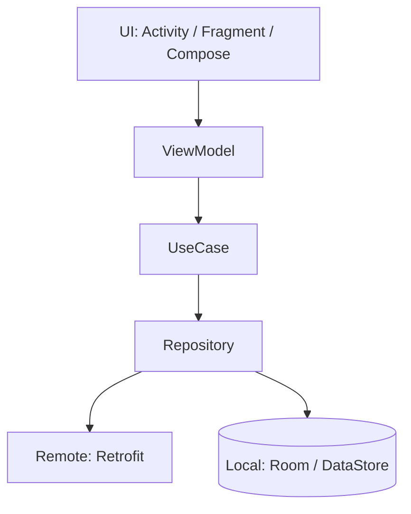
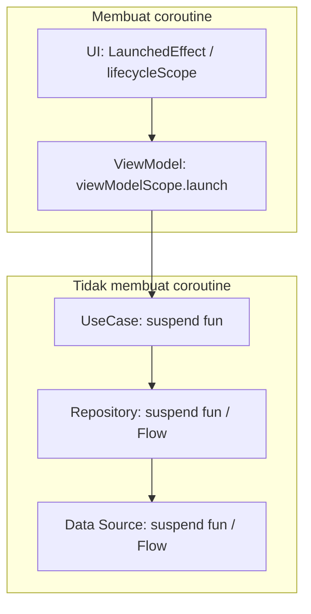
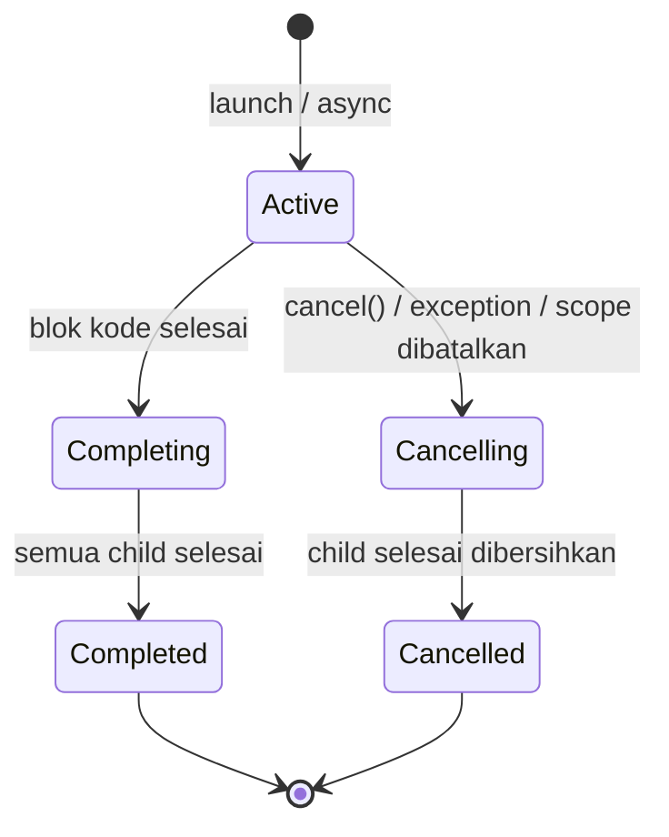
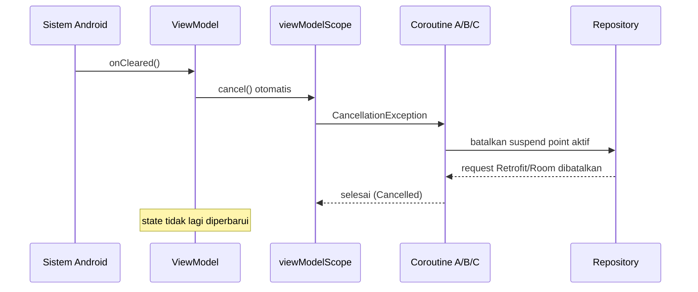
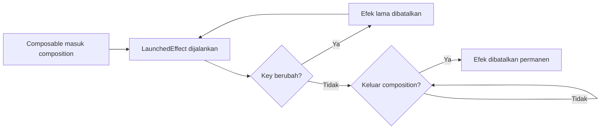

# 13 — Diagram & Ownership

> Visual untuk menjawab dua pertanyaan: *data mengalir ke mana* dan *coroutine ini milik siapa*.

## Alur layer



Arah panggilan ke bawah; arah data kembali ke atas sebagai `suspend fun` return value atau `Flow`.

---

## Di mana coroutine dibuat



---

## Ownership coroutine di ViewModel

```text
ViewModel
   │
   └── viewModelScope  (SupervisorJob + Dispatchers.Main.immediate)
          │
          ├── Coroutine A  → load profile
          ├── Coroutine B  → observe notifications
          └── Coroutine C  → submit form
                   │
                   └── coroutineScope
                          ├── async → getUser()
                          └── async → getTransactions()
```

Yang berlaku pada struktur ini:

| Kejadian | Akibat |
|---|---|
| Coroutine A gagal | Hanya A yang mati; B dan C tetap jalan (karena `SupervisorJob`) |
| `async` di dalam C gagal | Seluruh `coroutineScope` di C dibatalkan, exception dilempar ke C |
| C dibatalkan | Kedua `async` di dalamnya ikut dibatalkan |
| ViewModel di-clear | A, B, C, dan seluruh child-nya dibatalkan |

---

## Siklus hidup coroutine



Catatan: state `Completing` menjelaskan mengapa `coroutineScope` tidak langsung selesai — parent menunggu seluruh child.

---

## Apa yang terjadi saat ViewModel di-clear



Urutan detailnya:

1. Activity/Fragment benar-benar selesai (bukan sekadar rotasi) → `ViewModelStore.clear()`.
2. `ViewModel.onCleared()` dipanggil, dan `viewModelScope` dibatalkan.
3. Semua coroutine child menerima `CancellationException` pada titik suspend berikutnya.
4. Panggilan Retrofit yang sedang berjalan dibatalkan (OkHttp call di-cancel), query Room dihentikan.
5. Blok `finally` dijalankan untuk membersihkan resource.
6. Tidak ada lagi update ke `StateFlow` — tidak ada kebocoran memori.

Yang **tidak** terjadi:

- Rotasi layar **tidak** membersihkan ViewModel, sehingga request tetap berjalan dan hasilnya tetap tampil setelah layar dibuat ulang. Ini keunggulan utama `viewModelScope` dibanding `lifecycleScope`.

---

## Ownership pada View layer

```text
Activity / Fragment
   │
   ├── lifecycleScope                     → dibatalkan pada onDestroy
   │      └── repeatOnLifecycle(STARTED)  → dibatalkan pada onStop, jalan lagi pada onStart
   │             ├── collect uiState
   │             └── collect events
   │
   └── viewLifecycleOwner.lifecycleScope  → dibatalkan saat view Fragment dihancurkan
```

---

## Ownership pada Compose

```text
Composition
   │
   ├── LaunchedEffect(key)        → dibatalkan saat keluar composition / key berubah
   ├── rememberCoroutineScope()   → dibatalkan saat keluar composition
   └── collectAsStateWithLifecycle()
              └── collect berhenti saat lifecycle < STARTED
```



---

## Perbandingan umur scope

```text
Proses aplikasi   ├──────────────────────────────────────────────┤
Application scope ├──────────────────────────────────────────────┤
ViewModel         │      ├───────────────────────────┤            (selamat rotasi)
Activity/Fragment │      ├──────┤  rotasi  ├─────────┤
View Fragment     │      ├────┤            ├───────┤
Composition       │        ├──┤              ├────┤
```

Pilih scope berdasarkan garis mana yang paling cocok dengan umur pekerjaan:

| Umur pekerjaan | Scope |
|---|---|
| Selama layar ada, selamat rotasi | `viewModelScope` |
| Selama layar terlihat | `repeatOnLifecycle(STARTED)` |
| Selama view/composable ada | `viewLifecycleOwner.lifecycleScope`, `rememberCoroutineScope` |
| Selama aplikasi berjalan | Application scope yang di-inject |
| Harus selesai walau aplikasi mati | `WorkManager` |

Lanjut ke [14 — Decision Guide](14-decision-guide.md).
