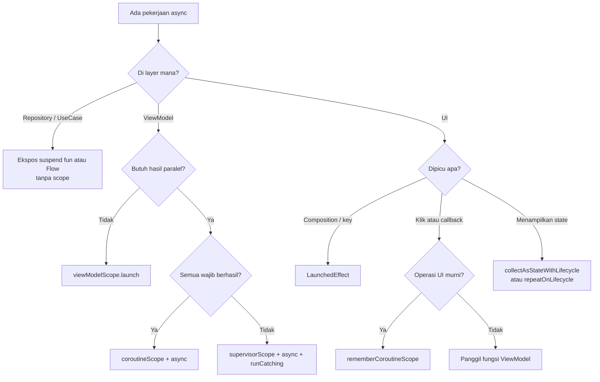

# 14 — Decision Guide

> Cheat sheet untuk dibuka saat coding. Cari situasinya, ambil jawabannya.

## Pertanyaan cepat

```text
Perlu menjalankan suspend function dari ViewModel?
→ viewModelScope.launch

Perlu menjalankan suspend operation dari Compose sebagai efek lifecycle?
→ LaunchedEffect(key)

Perlu menjalankan coroutine setelah user klik button di Compose?
→ Panggil fungsi ViewModel.
  rememberCoroutineScope hanya untuk operasi UI murni (snackbar, scroll, sheet).

Perlu menjalankan 2 API secara parallel?
→ coroutineScope + async + await

Perlu 2 API parallel tapi salah satunya boleh gagal?
→ supervisorScope + async + runCatching per bagian

Perlu pindah thread untuk blocking IO?
→ withContext(Dispatchers.IO), hanya bila operasinya memang blocking

Repository hanya menyediakan data?
→ Ekspos suspend fun / Flow. Jangan membuat coroutine sendiri.

Perlu menampilkan data yang terus berubah dari database?
→ Repository: Flow → ViewModel: stateIn → Compose: collectAsStateWithLifecycle

Perlu collect Flow di Activity/Fragment?
→ lifecycleScope.launch { repeatOnLifecycle(STARTED) { collect { } } }

Perlu event sekali-jalan (navigasi, snackbar)?
→ SharedFlow(replay = 0) atau state + fungsi consume di ViewModel

Perlu membatalkan request lama saat user mengetik lagi?
→ Simpan Job, panggil job?.cancel() sebelum launch baru

Perlu pekerjaan yang tetap jalan setelah layar ditutup?
→ Application scope yang di-inject

Perlu pekerjaan yang tetap selesai walau aplikasi dimatikan?
→ WorkManager

Perlu kalkulasi berat yang membuat UI nge-lag?
→ withContext(Dispatchers.Default)

Perlu timeout untuk sebuah request?
→ withTimeoutOrNull(ms) { }
```

---

## Memilih scope

| Situasi | Scope |
|---|---|
| Load data layar, submit form, retry | `viewModelScope` |
| Animasi/transisi View | `lifecycleScope` |
| Menyentuh binding/view di Fragment | `viewLifecycleOwner.lifecycleScope` |
| Snackbar, `animateScrollTo`, `sheetState.show()` | `rememberCoroutineScope()` |
| Efek saat layar pertama tampil atau argumen berubah | `LaunchedEffect(key)` |
| Analytics, sinkronisasi lintas layar | Application scope (di-inject) |
| Upload wajib selesai | `WorkManager` |
| Di dalam Repository/UseCase | Tidak ada scope; `suspend fun`/`Flow` |

---

## Memilih builder

| Situasi | Builder |
|---|---|
| Menjalankan pekerjaan lalu memperbarui state | `launch` |
| Dua atau lebih pekerjaan independen | `async` di dalam `coroutineScope` |
| N item dari list id | `map { async { } }.awaitAll()` |
| Pekerjaan berurutan | Panggil `suspend fun` langsung |
| Pindah thread untuk satu blok | `withContext` |

---

## Memilih dispatcher

| Operasi | Dispatcher |
|---|---|
| Retrofit `suspend` | Tidak ada (biarkan) |
| Room `suspend`/`Flow` | Tidak ada (biarkan) |
| DataStore | Tidak ada (biarkan) |
| `File`, `InputStream`, `SharedPreferences.commit()` | `Dispatchers.IO` |
| SDK pihak ketiga yang blocking | `Dispatchers.IO` |
| Parsing/sorting/kalkulasi berat | `Dispatchers.Default` |
| Update view/state | Tidak ada (scope sudah `Main.immediate`) |

---

## Memilih tipe stream

| Kebutuhan | Tipe |
|---|---|
| Satu hasil | `suspend fun` |
| Data berubah dari sumber (DB, prefs) | `Flow` |
| State layar | `StateFlow` |
| Event sekali-jalan | `SharedFlow(replay = 0)` |
| Menggabungkan beberapa sumber | `combine` → `stateIn` |

---

## Memilih penanganan error

| Situasi | Cara |
|---|---|
| Error jaringan/database yang bisa diprediksi | Ubah menjadi `AppResult.Failure` di layer data |
| Error tak terduga pada satu `launch` | `try/catch` + update state error |
| Jaring pengaman & logging | `CoroutineExceptionHandler` pada root `launch` |
| Salah satu dari beberapa request boleh gagal | `supervisorScope` + `runCatching` |
| Error pada stream | `Flow.catch` (+ `retryWhen` untuk error sementara) |
| Cancellation | Selalu `throw` ulang |

---

## Alur keputusan lengkap



---

## Pemeriksaan 30 detik sebelum commit

- [ ] Tidak ada `GlobalScope`.
- [ ] Tidak ada `CoroutineScope(` di Repository/UseCase.
- [ ] Tidak ada `withContext(Dispatchers.IO)` yang membungkus Retrofit/Room.
- [ ] Setiap `catch (Throwable)` mendahulukan `CancellationException`.
- [ ] Collect `Flow` di View memakai `repeatOnLifecycle`, di Compose memakai `collectAsStateWithLifecycle`.
- [ ] `MutableStateFlow` tidak diekspos ke UI.
- [ ] `async` hanya dipakai bila benar-benar paralel.
- [ ] State diperbarui dengan `update { }`.

Lanjut ke [15 — Best Practices](15-best-practices.md).
