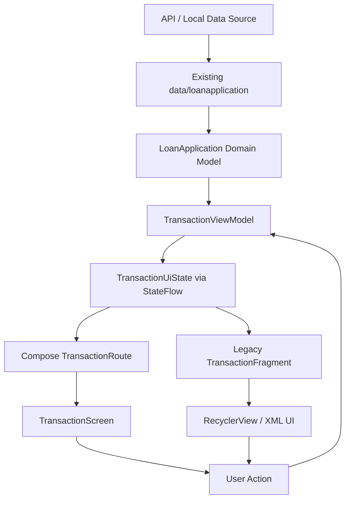

# Prompt Implementasi Transaction / Loan Application List Android

Implementasikan UI **Transaction / Loan Application List** berdasarkan image reference yang saya berikan.

Target implementasi harus dibuat dalam **2 versi**:

1. **Jetpack Compose**
   - Main screen:
     `app/src/main/java/com/masesas/exercise/bcaf_test_1/presentation/compose/transaction/TransactionScreen.kt`

2. **XML / Legacy Android View**
   - Main Fragment:
     `app/src/main/java/com/masesas/exercise/bcaf_test_1/presentation/legacy/transaction/TransactionFragment.kt`

Gunakan design image yang saya berikan sebagai **visual reference utama**.

---

# 1. Visual Design Requirement

Implementasikan tampilan sedekat mungkin dengan reference design.

## Header

Bagian atas screen menggunakan background biru / blue gradient.

Header memiliki:

- back icon
- filter/settings icon di kanan
- title:

```text
Loan
Applications
```

Title menggunakan:

- warna putih
- bold
- ukuran cukup besar
- alignment kiri

Di sisi kanan title terdapat illustration sederhana seperti:

- document
- paper
- plant
- approved/check icon

Jika asset illustration belum tersedia:

- gunakan placeholder/vector sederhana
- jangan membuat dependency eksternal hanya untuk illustration
- prioritaskan struktur UI terlebih dahulu

Header memiliki bentuk transisi menuju content dengan efek:

```text
blue header
      ↓
curved / wave white container
```

Tidak harus membuat wave yang terlalu kompleks.

Gunakan pendekatan yang mudah dipelihara.

---

# 2. Filter Tabs

Di bawah header terdapat horizontal filter:

```text
All
In Review
Approved
Rejected
```

Selected tab:

```text
All
```

memiliki:

- blue background
- white text
- rounded pill shape

Unselected tab:

- transparent background
- dark text

Tabs harus reusable.

State selected tab jangan hardcoded di component item.

Gunakan state hoisting.

Contoh:

```kotlin
selectedFilter: LoanFilter
onFilterSelected: (LoanFilter) -> Unit
```

---

# 3. Loan Application List

Tampilkan loan application menggunakan vertical scrolling list.

Data contoh:

```text
LA-2024-00125
Personal Loan
Rp 50.000.000
2 May 2024
Approved
```

```text
LA-2024-00124
Business Loan
Rp 150.000.000
30 Apr 2024
In Review
```

```text
LA-2024-00123
Vehicle Loan
Rp 75.000.000
28 Apr 2024
Submitted
```

```text
LA-2024-00122
Education Loan
Rp 30.000.000
25 Apr 2024
Rejected
```

```text
LA-2024-00121
Home Renovation Loan
Rp 25.000.000
20 Apr 2024
Approved
```

Dummy data hanya boleh digunakan jika data layer belum dapat menghasilkan data pada saat preview/testing UI.

Untuk runtime utama, screen harus mengambil data melalui ViewModel dan existing data layer.

---

# 4. Existing Domain Model Requirement

**Jangan membuat domain model loan application baru jika model yang dibutuhkan sudah tersedia.**

Gunakan existing model:

```text
app/src/main/java/com/masesas/exercise/bcaf_test_1/domain/loanapplication/model/LoanApplication.kt
```

Sebelum implementasi:

1. Baca struktur `LoanApplication.kt`.
2. Gunakan field existing sebanyak mungkin.
3. Jangan menduplikasi model domain menjadi model lain tanpa alasan yang kuat.
4. Jika UI membutuhkan representasi tambahan seperti formatted amount, formatted date, icon, background color, atau label status, gunakan:
   - UI mapper
   - extension function
   - computed property di presentation layer
   - UI-specific configuration

Jangan memodifikasi domain model hanya demi kebutuhan styling UI.

Contoh alur yang diharapkan:

```text
Data Layer
   ↓
LoanApplication domain model
   ↓
ViewModel
   ↓
UiState
   ↓
Compose / Fragment
```

Jika dibutuhkan UI model, gunakan hanya ketika benar-benar memberikan manfaat, misalnya untuk transformasi presentation-specific.

Contoh:

```kotlin
data class LoanApplicationUiModel(
    val application: LoanApplication,
    val formattedAmount: String,
    val formattedDate: String
)
```

Namun prioritaskan penggunaan langsung `LoanApplication` jika mapping tambahan tidak diperlukan.

---

# 5. Existing Data Layer Requirement

Gunakan existing data layer pada:

```text
app/src/main/java/com/masesas/exercise/bcaf_test_1/data/loanapplication
```

Sebelum membuat ViewModel:

1. Inspect seluruh file relevan pada package tersebut.
2. Cari repository, data source, API service, implementation, mapper, atau abstraction yang sudah tersedia.
3. Gunakan abstraction existing.
4. Jangan membuat repository baru jika repository dengan responsibility yang sama sudah tersedia.
5. Jangan melakukan pemanggilan Retrofit/HTTP/database langsung dari ViewModel jika data layer sudah menyediakan abstraction.

Target dependency flow:

```text
TransactionScreen / TransactionFragment
            ↓
TransactionViewModel
            ↓
Existing Loan Application Repository / Data Source
            ↓
API / Local Data Source
```

ViewModel tidak boleh mengetahui detail networking seperti:

```text
Retrofit
OkHttp
endpoint URL
ResponseBody
HttpException handling detail
```

selama detail tersebut sudah menjadi responsibility data layer.

---

# 6. ViewModel Requirement

Buat ViewModel di package:

```text
app/src/main/java/com/masesas/exercise/bcaf_test_1/presentation/viewmodel
```

Contoh target:

```text
app/src/main/java/com/masesas/exercise/bcaf_test_1/presentation/viewmodel/TransactionViewModel.kt
```

atau nama lain yang lebih sesuai dengan convention existing project.

Jangan membuat ViewModel terpisah hanya karena screen memiliki dua renderer berbeda.

Gunakan **satu ViewModel yang sama** untuk:

```text
Jetpack Compose TransactionScreen
XML TransactionFragment
```

selama keduanya merepresentasikan feature dan state yang sama.

Tujuan:

```text
Compose
      ↘
       TransactionViewModel
      ↗
XML
```

Dengan begitu Compose dan XML menjadi dua presentation renderer dari business state yang sama.

---

# 7. ViewModel State Management

Gunakan pendekatan modern Kotlin:

```text
StateFlow
SharedFlow
Coroutines
```

Gunakan `StateFlow` untuk state UI yang persisten.

Contoh:

```kotlin
data class TransactionUiState(
    val applications: List<LoanApplication> = emptyList(),
    val selectedFilter: LoanFilter = LoanFilter.ALL,
    val isLoading: Boolean = false,
    val errorMessage: String? = null
)
```

ViewModel:

```kotlin
private val _uiState = MutableStateFlow(TransactionUiState())

val uiState: StateFlow<TransactionUiState> =
    _uiState.asStateFlow()
```

Jika diperlukan one-time event seperti:

- navigation
- snackbar
- toast
- error message sekali tampil

boleh menggunakan:

```text
SharedFlow
Channel
```

namun jangan menggunakan event stream jika tidak diperlukan.

---

# 8. ViewModel Responsibility

ViewModel bertanggung jawab untuk:

- mengambil daftar loan application dari data layer
- menyimpan current UI state
- menangani filter yang dipilih
- melakukan transformasi data yang memang presentation-specific
- menangani loading state
- menangani error state
- expose state ke Compose dan Fragment

Contoh API:

```kotlin
class TransactionViewModel(
    private val loanApplicationRepository: LoanApplicationRepository
) : ViewModel() {

    val uiState: StateFlow<TransactionUiState>

    fun loadApplications()

    fun onFilterSelected(filter: LoanFilter)

    fun refresh()
}
```

Nama dependency harus menyesuaikan abstraction existing pada:

```text
data/loanapplication
```

Jangan memaksakan nama `LoanApplicationRepository` jika project menggunakan nama abstraction lain.

---

# 9. ViewModel Initialization

Jika data harus otomatis dimuat saat screen pertama kali dibuka:

boleh gunakan:

```kotlin
init {
    loadApplications()
}
```

Namun lakukan ini hanya jika sesuai dengan lifecycle dan existing architecture project.

Hindari duplicate API call dari:

```text
ViewModel.init
+
Composable LaunchedEffect
+
Fragment onViewCreated
```

Pilih satu source of truth untuk initial loading.

Prefer:

```text
ViewModel init
```

jika data memang selalu dibutuhkan ketika ViewModel dibuat.

---

# 10. ViewModel Coroutine Rules

Gunakan:

```kotlin
viewModelScope.launch {
    ...
}
```

Jangan membuat:

```kotlin
CoroutineScope(Dispatchers.IO)
```

manual di dalam ViewModel.

Jika repository sudah mengatur dispatcher, jangan duplicate dispatcher management tanpa alasan.

Jika repository tidak mengatur dispatcher dan operasi benar-benar blocking, gunakan dispatcher sesuai existing project convention.

---

# 11. Filtering Strategy

Filter:

```kotlin
enum class LoanFilter {
    ALL,
    IN_REVIEW,
    APPROVED,
    REJECTED
}
```

Jangan melakukan filtering yang sama secara terpisah di Compose dan Fragment.

Filtering harus menjadi responsibility ViewModel atau presentation mapper.

Contoh:

```text
Repository returns applications
        ↓
ViewModel stores original list
        ↓
ViewModel applies selected filter
        ↓
UiState exposes filtered list
```

Tujuannya agar:

```text
Compose
XML
```

menampilkan data yang konsisten.

---

# 12. Loan Application Card

Setiap item harus memiliki layout kurang lebih:

```text
┌──────────────────────────────────┐
│ [ICON] LA-2024-00125   2 May 2024│
│        Personal Loan              │
│        Rp 50.000.000   [Approved] │
└──────────────────────────────────┘
```

Card memiliki:

- rounded corner
- subtle background color
- padding konsisten
- tidak menggunakan shadow berlebihan

Background card dapat berbeda berdasarkan kategori/status seperti reference design.

Contoh:

```text
Personal Loan       → light blue
Business Loan       → light orange
Vehicle Loan        → light green
Education Loan      → light red
Home Renovation     → light purple
```

Gunakan warna yang lembut / pastel.

Jangan menggunakan saturated color berlebihan.

---

# 13. Loan Icon

Setiap kategori loan memiliki icon.

Contoh:

```text
Personal Loan
→ document / wallet icon

Business Loan
→ building icon

Vehicle Loan
→ car icon

Education Loan
→ education/document/error icon

Home Renovation Loan
→ house icon
```

Icon berada di dalam rounded/circular background.

Buat komponen icon reusable.

Contoh conceptual API:

```kotlin
LoanTypeIcon(
    type = loanApplication.type
)
```

Mapping icon harus terpusat dan jangan diulang di banyak tempat.

---

# 14. Loan Status

Status harus dibuat sebagai reusable component.

Contoh visual mapping:

```text
Approved
green text
light green background
check icon
```

```text
In Review
blue text
light blue background
clock icon
```

```text
Submitted
orange text
light orange background
clock/pending icon
```

```text
Rejected
red text
light red background
close icon
```

Gunakan status dari existing domain model `LoanApplication`.

Jika status di domain model berupa enum, gunakan enum existing.

Jangan membuat enum status duplicate tanpa alasan.

Jika status berupa string/backend value, buat mapper presentation layer yang terpusat.

Hindari kondisi berulang seperti:

```kotlin
if (status == "Approved") ...
else if (status == "Rejected") ...
```

di berbagai component.

Gunakan helper/mapping terpusat.

---

# 15. New Application Button

Pada bagian bawah terdapat CTA:

```text
+ New Application
```

Button:

- pill shaped
- white background
- blue icon
- blue text

Callback:

```kotlin
onNewApplicationClick: () -> Unit
```

Navigation tidak boleh diletakkan di atomic component.

Navigation diputuskan oleh:

```text
Screen host
Nav graph
Fragment
```

---

# 16. Jetpack Compose Implementation

Target:

```text
presentation/compose/transaction/TransactionScreen.kt
```

Gunakan:

```text
Material 3
LazyColumn
Row
Column
Box
Surface/Card
Icon
Text
Modifier
```

Screen utama idealnya menerima state dan callback.

Contoh:

```kotlin
@Composable
fun TransactionScreen(
    state: TransactionUiState,
    onFilterSelected: (LoanFilter) -> Unit,
    onTransactionClick: (LoanApplication) -> Unit,
    onNewApplicationClick: () -> Unit,
    onBackClick: () -> Unit,
    onFilterClick: () -> Unit
)
```

Jika project menggunakan ViewModel langsung pada route-level composable, pisahkan:

```text
TransactionRoute
TransactionScreen
```

Contoh:

```kotlin
@Composable
fun TransactionRoute(
    viewModel: TransactionViewModel = ...
) {
    val state by viewModel.uiState.collectAsStateWithLifecycle()

    TransactionScreen(
        state = state,
        onFilterSelected = viewModel::onFilterSelected,
        ...
    )
}
```

`TransactionScreen` tetap stateless terhadap ViewModel.

---

# 17. Compose State Collection

Gunakan lifecycle-aware collection:

```kotlin
collectAsStateWithLifecycle()
```

jika dependency lifecycle-compose sudah tersedia.

Prefer:

```kotlin
val state by viewModel.uiState.collectAsStateWithLifecycle()
```

daripada:

```kotlin
collectAsState()
```

untuk screen yang terikat lifecycle Android.

Jangan melakukan manual `viewModelScope` atau repository call dari composable.

---

# 18. Compose Atomic / Reusable Components

Jangan membuat semua UI di dalam:

```kotlin
TransactionScreen()
```

Pisahkan menjadi reusable composables.

Minimal:

```text
LoanApplicationHeader
LoanFilterTabs
LoanFilterTab
LoanApplicationCard
LoanApplicationIcon
LoanStatusChip
NewApplicationButton
LoanApplicationList
```

Contoh:

```kotlin
@Composable
fun LoanStatusChip(
    status: ...,
    modifier: Modifier = Modifier
)
```

```kotlin
@Composable
fun LoanApplicationCard(
    application: LoanApplication,
    onClick: () -> Unit,
    modifier: Modifier = Modifier
)
```

```kotlin
@Composable
fun LoanFilterTabs(
    selectedFilter: LoanFilter,
    onFilterSelected: (LoanFilter) -> Unit,
    modifier: Modifier = Modifier
)
```

Atomic components tidak boleh bergantung langsung ke:

```text
NavController
ViewModel
Fragment
Activity
Repository
```

Gunakan parameter dan callback.

---

# 19. Compose Preview

Tambahkan preview.

Minimal:

```text
TransactionScreenPreview
LoanApplicationCardPreview
LoanStatusChipPreview
```

Gunakan dummy `LoanApplication` yang sesuai constructor existing domain model.

Preview tidak boleh membutuhkan:

```text
ViewModel
Repository
API
Database
```

---

# 20. XML Based Implementation

Target utama:

```text
presentation/legacy/transaction/TransactionFragment.kt
```

Gunakan:

```text
RecyclerView
ListAdapter
DiffUtil.ItemCallback
ViewBinding
Material Components
```

Contoh resources:

```text
res/layout/
    fragment_transaction.xml
    item_loan_application.xml
```

Jika reusable layout diperlukan:

```text
view_loan_status.xml
view_loan_filter_tab.xml
```

Tetapi jangan membuat terlalu banyak XML kecil jika tidak memberikan manfaat nyata.

---

# 21. Fragment + ViewModel Integration

`TransactionFragment` harus menggunakan ViewModel yang sama dengan Compose implementation.

Contoh:

```kotlin
private val viewModel: TransactionViewModel by viewModels()
```

atau gunakan dependency injection mechanism existing project.

Observe `StateFlow` dengan lifecycle-aware collection.

Contoh:

```kotlin
viewLifecycleOwner.lifecycleScope.launch {
    viewLifecycleOwner.repeatOnLifecycle(
        Lifecycle.State.STARTED
    ) {
        viewModel.uiState.collect { state ->
            renderState(state)
        }
    }
}
```

Jangan menggunakan:

```text
GlobalScope
manual CoroutineScope
observeForever
```

---

# 22. RecyclerView Adapter

Gunakan:

```kotlin
ListAdapter<LoanApplication, LoanApplicationViewHolder>
```

dan:

```kotlin
DiffUtil.ItemCallback<LoanApplication>
```

Jangan gunakan `notifyDataSetChanged()` untuk setiap update.

Adapter hanya bertanggung jawab untuk:

- bind data
- render row
- meneruskan click callback

Adapter tidak boleh:

- call repository
- call API
- mengubah ViewModel state langsung tanpa callback
- melakukan navigation secara langsung

---

# 23. XML Styling

Jangan hardcode warna berulang di XML.

Hindari:

```xml
android:textColor="#128A42"
```

berulang kali.

Gunakan resources:

```text
colors.xml
dimens.xml
styles.xml
themes.xml
```

Contoh semantic color:

```text
loan_status_approved
loan_status_approved_background

loan_status_review
loan_status_review_background

loan_status_submitted
loan_status_submitted_background

loan_status_rejected
loan_status_rejected_background
```

---

# 24. Drawable

Gunakan drawable resources untuk:

```text
rounded card background
status pill background
filter selected background
header background
CTA background
```

Jika memungkinkan gunakan:

```xml
<shape>
```

daripada PNG.

---

# 25. ViewBinding

Untuk XML implementation gunakan ViewBinding.

Jangan gunakan `findViewById()` jika ViewBinding sudah aktif.

Ikuti pattern existing project.

Contoh:

```kotlin
private var _binding: FragmentTransactionBinding? = null

private val binding
    get() = _binding!!

override fun onDestroyView() {
    super.onDestroyView()
    _binding = null
}
```

Jika project sudah memiliki `BaseFragment`, ikuti convention existing.

---

# 26. Loading / Empty / Error / Content

Screen harus memiliki minimal empat kondisi:

```text
Loading
Empty
Error
Content
```

State berasal dari ViewModel yang sama.

Contoh:

```kotlin
when {
    state.isLoading -> ...
    state.errorMessage != null -> ...
    state.applications.isEmpty() -> ...
    else -> ...
}
```

Compose dan XML harus menampilkan behavior yang konsisten.

---

# 27. Currency Formatting

Gunakan amount dari existing `LoanApplication`.

Jika amount di domain berupa numeric type, jangan convert ke formatted string terlalu awal.

Buat formatter reusable, misalnya:

```kotlin
fun Long.toRupiah(): String
```

atau gunakan formatter existing project.

Output:

```text
Rp 50.000.000
```

Jangan duplicate formatter pada:

```text
Compose
Adapter
Fragment
ViewModel
```

Pilih satu reusable formatter.

---

# 28. Date Formatting

Jika domain model menyimpan:

```text
Instant
LocalDate
LocalDateTime
timestamp
ISO string
```

format di presentation layer menjadi:

```text
2 May 2024
```

Gunakan formatter reusable.

Jangan mengubah format data pada data/domain layer hanya untuk kebutuhan tampilan.

---

# 29. Separation of Concern

Gunakan pembagian responsibility:

```text
Data Layer
    ↓
Repository / Data Source
    ↓
Domain LoanApplication
    ↓
TransactionViewModel
    ↓
TransactionUiState
    ↓
Compose / Fragment
```

Business logic jangan diletakkan di:

```text
RecyclerView Adapter
ViewHolder
Composable atomic component
Custom View
Fragment XML binding code
```

---

# 30. Reusability Rule

Ini adalah requirement penting.

Jangan membuat `TransactionScreen` atau `TransactionFragment` menjadi god component.

Gunakan rule:

```text
Screen / Fragment
    ↓
Section
    ↓
Reusable Component
    ↓
Atomic Component
```

Compose:

```text
TransactionScreen
│
├── LoanApplicationHeader
│
├── LoanFilterTabs
│   └── LoanFilterTab
│
├── LoanApplicationList
│   └── LoanApplicationCard
│       ├── LoanTypeIcon
│       └── LoanStatusChip
│
└── NewApplicationButton
```

XML:

```text
TransactionFragment
│
├── Header
├── Filter Section
├── RecyclerView
│   └── LoanApplicationAdapter
│       └── LoanApplicationViewHolder
│
└── New Application CTA
```

Jangan melakukan over-engineering seperti membuat custom class untuk setiap TextView.

---

# 31. Expected Compose Structure

Rekomendasi:

```text
presentation/
├── viewmodel/
│   └── TransactionViewModel.kt
│
└── compose/
    └── transaction/
        ├── TransactionScreen.kt
        ├── TransactionUiState.kt
        ├── LoanFilter.kt
        │
        └── component/
            ├── LoanApplicationHeader.kt
            ├── LoanApplicationCard.kt
            ├── LoanApplicationList.kt
            ├── LoanStatusChip.kt
            ├── LoanFilterTabs.kt
            ├── LoanTypeIcon.kt
            └── NewApplicationButton.kt
```

Tidak wajib mengikuti struktur ini secara absolut.

Sesuaikan dengan convention existing project.

---

# 32. Expected Legacy Structure

Rekomendasi:

```text
presentation/
├── viewmodel/
│   └── TransactionViewModel.kt
│
└── legacy/
    └── transaction/
        ├── TransactionFragment.kt
        ├── LoanApplicationAdapter.kt
        └── LoanApplicationViewHolder.kt
```

Resources:

```text
res/
├── layout/
│   ├── fragment_transaction.xml
│   └── item_loan_application.xml
│
├── drawable/
│   ├── bg_transaction_header.xml
│   ├── bg_loan_card.xml
│   ├── bg_filter_selected.xml
│   └── ...
│
└── values/
    ├── colors.xml
    ├── dimens.xml
    └── styles.xml
```

---

# 33. Existing Architecture First

Sebelum menulis kode:

1. Inspect:
   - `domain/loanapplication/model/LoanApplication.kt`
   - `data/loanapplication`
   - existing ViewModel implementation
   - existing Compose theme
   - existing XML theme/styles
   - existing navigation
   - existing dependency injection
   - existing error/result wrapper
   - existing repository convention

2. Gunakan abstraction existing terlebih dahulu.

3. Jangan membuat duplicate:
   - model
   - repository
   - mapper
   - formatter
   - result wrapper
   - DI configuration
   - component

4. Jika ada ketidaksesuaian antara requirement dengan existing architecture, prioritaskan existing architecture selama tetap memenuhi tujuan feature.

---

# 34. Do Not Over-Engineer

Project ini merupakan exercise / application test.

Jangan menambahkan:

```text
complex Clean Architecture
repository baru tanpa kebutuhan
use case baru tanpa kebutuhan
MVI framework
third-party state library
third-party UI library
design system kompleks
abstraction layer berlebihan
```

Prioritas:

```text
Readable
Reusable
Maintainable
Easy to understand
Close to reference design
Consistent between Compose and XML
```

---

# 35. Important Coding Rules

Gunakan:

```text
Kotlin idiomatic code
Material 3
StateFlow
viewModelScope
lifecycle-aware state collection
immutable UiState
state hoisting
callback event
semantic naming
existing domain model
existing data layer
reusable atomic UI
```

Hindari:

```text
God Composable
God Fragment
duplicate domain model
duplicate repository
hardcoded repeated colors
duplicate formatter
business logic di UI
repository call di Composable
repository call di Adapter
NavController di atomic component
ViewModel di atomic component
GlobalScope
observeForever
notifyDataSetChanged()
findViewById()
```

---

# 36. Acceptance Criteria

Implementasi dianggap selesai jika memenuhi seluruh kriteria berikut:

## Architecture

- [ ] Menggunakan existing `LoanApplication.kt`
- [ ] Menggunakan existing data layer di `data/loanapplication`
- [ ] Memiliki `TransactionViewModel` di `presentation/viewmodel`
- [ ] Compose dan XML menggunakan ViewModel yang sama
- [ ] ViewModel menggunakan coroutine + `viewModelScope`
- [ ] ViewModel expose state menggunakan `StateFlow`
- [ ] Tidak ada direct API call di Fragment/Composable
- [ ] Tidak membuat repository/model duplicate tanpa alasan

## Compose

- [ ] `TransactionScreen.kt` selesai
- [ ] Menggunakan Material 3
- [ ] Menggunakan `LazyColumn`
- [ ] State di-hoist
- [ ] Lifecycle-aware StateFlow collection
- [ ] Atomic/reusable components dibuat
- [ ] Preview tersedia
- [ ] Tidak ada business logic di atomic composable

## XML

- [ ] `TransactionFragment.kt` selesai
- [ ] Menggunakan ViewBinding
- [ ] Menggunakan RecyclerView
- [ ] Menggunakan ListAdapter
- [ ] Menggunakan DiffUtil
- [ ] Menggunakan lifecycle-aware StateFlow collection
- [ ] Tidak menggunakan `notifyDataSetChanged()` untuk normal update
- [ ] Tidak menggunakan `findViewById()`

## UI

- [ ] Header sesuai reference
- [ ] Filter tabs tersedia
- [ ] Selected filter tampil jelas
- [ ] Card list menyerupai reference
- [ ] Loan type icon tersedia
- [ ] Status chip tersedia
- [ ] CTA New Application tersedia
- [ ] Loading state tersedia
- [ ] Empty state tersedia
- [ ] Error state tersedia
- [ ] Content state tersedia

## Reusability

- [ ] Loan status mapping terpusat
- [ ] Loan type mapping terpusat
- [ ] Currency formatter reusable
- [ ] Date formatter reusable
- [ ] Atomic component tidak mengetahui navigation
- [ ] Adapter tidak mengetahui repository/API

---

# 37. Final Output

Setelah implementasi selesai, berikan summary:

```text
1. Files created
2. Files modified
3. Reusable components created
4. ViewModel implementation
5. Existing domain model yang digunakan
6. Existing data layer yang digunakan
7. State management flow
8. Compose implementation explanation
9. XML implementation explanation
10. Mapping Compose dan XML
```

Berikan mapping seperti:

| UI / Logic | Compose | XML / Legacy |
|---|---|---|
| State owner | TransactionViewModel | TransactionViewModel |
| Domain model | LoanApplication | LoanApplication |
| Data source | existing data/loanapplication | existing data/loanapplication |
| Header | LoanApplicationHeader | fragment_transaction header |
| Tabs | LoanFilterTabs | filter container |
| Card | LoanApplicationCard | item_loan_application.xml |
| Status | LoanStatusChip | status view/style |
| List | LazyColumn | RecyclerView + ListAdapter |
| State observation | collectAsStateWithLifecycle | repeatOnLifecycle + collect |
| CTA | NewApplicationButton | MaterialButton |

---

# 38. Expected State Flow



---

# 39. Core Principle

Gunakan prinsip:

```text
One Domain Model
One Data Source Flow
One ViewModel
One UiState
Multiple UI Renderer
```

Dengan architecture:

```text
                Existing Data Layer
                       ↓
                LoanApplication
                       ↓
               TransactionViewModel
                       ↓
                TransactionUiState
                   ↙          ↘
          Jetpack Compose      XML Fragment
```

Dengan demikian Compose dan XML tidak memiliki business logic yang berbeda, dan keduanya tetap konsisten menggunakan source of truth yang sama.
